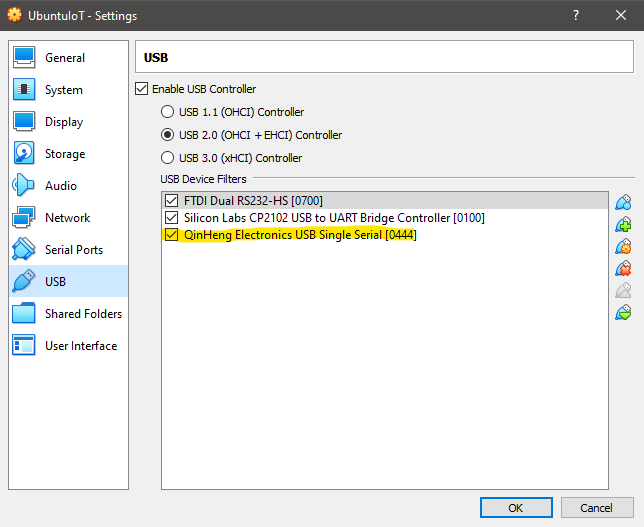
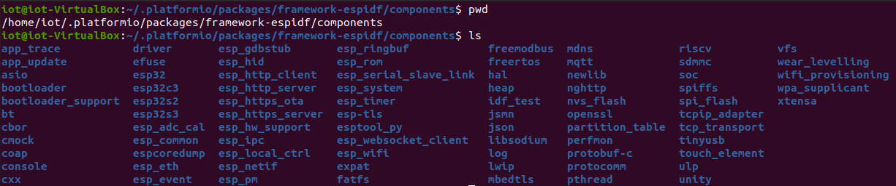
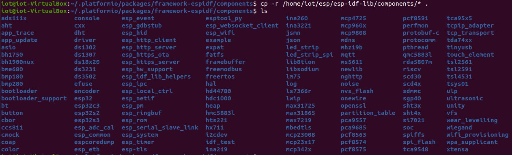

# Fu_IoT
This is a repository that contains PlatformIO Projects that implement ESP Examples that can be used with the [SaTC-PCB](https://github.com/xinwenfu/SaTC-PCB), more specifically the **Version 2** available at [Amazon](https://www.amazon.com/dp/B0C24FJBG9). 

## Virtual Box 
If you are using a Virtual Box VM (Or some other virtualization software) it is necessary for you to give the VM access to USB devices that are connected to your host machine. 
1. Navigate to Virtual Box
2. Navigate to the Setting of the IoT Virtual Machine
3. Navigate to the USB Settings
4. Click ADD 
5. Add the **QinHeng Electronics USB Single Serial** Device
    * This means the VM will have access to the ESP32 when it is connected **NOT the Host**
    


## Platform IO
The [PlatformIO](https://platformio.org/) extension for Visual Studio Code can streamline development and is a more friendly option when first starting out over the [ESP-IDF](https://docs.espressif.com/projects/esp-idf/en/latest/esp32/get-started/) command line tools.

There are a few interesting things that we should be aware of when working with PlatformIO.
1. All Components not defined in the packages folder located at **~/.platformio/packages/\*** should be included in a **component folder** in the root folder of a PlatformIO project. For an example you can refer to [BPCrypto](/Crypto-Coprocessor/BPCryptoPIO/).
    * The [BPCrypto](/Crypto-Coprocessor/BPCryptoPIO/) utilizes a modified [cryptoauth library](https://github.com/PBearson/esp-cryptoauthlib/tree/247756deacd2f5f011cb8bf675112f2a9d75370b)  
2. Some projects **bypass** this restriction by modifying the packages folder located at **~/.platformio/packages/\*** and adding their desired components to the components folder of the framework. This is why some Projects may lack the **components** folder, and can lead to frustration when recreating examples, see the differences between the **.pio** files of [AHT_Component](AHT/AHT_Component/) and [AHT_PIO_Packages](AHT/AHT_PIO_Packages/)

## Adding Components to PIO Framework
The following is a description of how we can add the components provided in the ESP-IDF download to the PlatformIO ESP-32 Package. The Descriptions and Images show how we can do this with the Command Line Interface (CLI).

1. Locate the ESP-IDF download files
    * If you are using the [IoT Virtual Machine]() this will be in the home directory **~/esp** (That is equivalent to **/home/iot/esp**)
    * If you are on your own machine, you will need to remember or find the location you installed this!
2. Locate the .platformio file
    * On Linux this should be located your home directory, since it is a hidden file (**begins with a period**) you will not see it with a simple **ls**. To see it in the output of **ls** you will need to add the **-a** flag (resulting in **ls -a**)
    * The components of the ESP-Package in this directory should look something like the following image
    
3. Copy the components files in the **ESP-IDF** download file to the **ESP32 framework** in the **.platformio/frameworks** folder. As shown in the image below (Command is provided below the image), as this is done from the library we use the destination **.**, the code below uses the full path relative to the user's home directory.
    
```sh 
$ cp -r ~/esp/esp-idf-lib/components/* ~/.platformio/packages/framework-espidf/components
```

